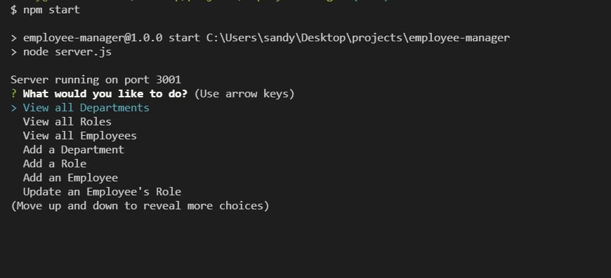

# Employee Manager

## Description

A database storage system to track employees along with their role, department, manager and salary.   
Not only can thisprogram be used to view the employees, roles, and departments,   
it can also add roles, add departments, add employees, as well as update an employee's role   


## Website
```
This code is not currently deployed to a website.
The link to the walkthrough video is  
https://drive.google.com/file/d/1BzK0gniiFjTmDsEKALszzW3xDVmnnh-t/view?usp=sharing  
```


## Credits
All code written by myself

## Technologies 
Technologies used in the making of this site include JavaScript, Node JS, MySQL, and inquirer

## License
There is currently no license applied to this website.